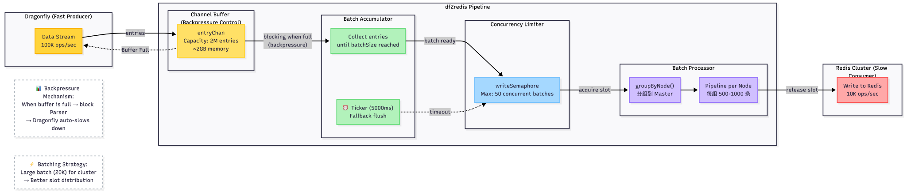

# Data Pipeline & Backpressure Control

This document explains df2redis's data pipeline architecture and how it handles the speed mismatch between Dragonfly (fast) and Redis (slower).

## The Speed Mismatch Problem

```
Dragonfly (Source)     df2redis (Pipeline)     Redis Cluster (Target)
  100K ops/sec    ────►   ?????  ────►   10K ops/sec
     (Fast)                              (Slower)
```

**Challenge**: Without proper buffering and backpressure control:
- Memory exhaustion (OOM)
- Goroutine explosion
- TCP buffer overflow

## Pipeline Architecture



```
┌──────────────────────────────────────────────────────────────────┐
│                   Dragonfly (Fast Producer)                      │
│                      ~100,000 ops/sec                            │
└─────────────────────────────────┬────────────────────────────────┘
                                  │
                                  │ RDB/Journal Stream
                                  ▼
                      ┌───────────────────────┐
                      │   RDB/Journal Parser  │
                      │    (N goroutines)     │
                      └───────────┬───────────┘
                                  │
                                  │ Parsed Entries
                                  ▼
┌──────────────────────────────────────────────────────────────────┐
│                   Channel Buffer (Backpressure)                  │
│                                                                  │
│  entryChan := make(chan *RDBEntry, 2000000)                      │
│                                                                  │
│  Capacity: 2M entries × 1KB/entry = 2GB per FLOW                 │
│  Total: N FLOWs × 2GB = 16GB memory                              │
│                                                                  │
│  When buffer is full → Parser blocks → Dragonfly slows down      │
└─────────────────────────────────┬────────────────────────────────┘
                                  │
                                  │ Buffered Entries
                                  ▼
                      ┌───────────────────────┐
                      │  Batch Accumulator    │
                      │                       │
                      │  Collects entries     │
                      │  until batchSize      │
                      │  (20K for cluster)    │
                      │                       │
                      │  ⏰ Ticker: 5000ms     │
                      │  (fallback flush)     │
                      └───────────┬───────────┘
                                  │
                                  │ Full Batch
                                  ▼
                      ┌───────────────────────┐
                      │  Concurrency Limiter  │
                      │                       │
                      │  Semaphore:           │
                      │  max 50 batches       │
                      └───────────┬───────────┘
                                  │
                                  │ Acquire Slot
                                  ▼
                      ┌───────────────────────┐
                      │  Batch Processor      │
                      │                       │
                      │  groupByNode()        │
                      │  → 3 node groups      │
                      └───────────┬───────────┘
                                  │
                                  │ Grouped Commands
                                  ▼
                      ┌───────────────────────┐
                      │  Pipeline Executor    │
                      │                       │
                      │  3 pipelines          │
                      │  (~666 cmds each)     │
                      └───────────┬───────────┘
                                  │
                                  │ Redis Commands
                                  ▼
┌──────────────────────────────────────────────────────────────────┐
│                 Redis Cluster (Slow Consumer)                    │
│                       ~10,000 ops/sec                            │
└──────────────────────────────────────────────────────────────────┘
```

## Component Breakdown

### 1. Channel Buffer (Backpressure Control)

**Purpose**: Absorb burst traffic and provide backpressure when target is slower than source.

```go
type FlowWriter struct {
    entryChan chan *RDBEntry  // Buffered channel
}

func NewFlowWriter(flowID int) *FlowWriter {
    return &FlowWriter{
        entryChan: make(chan *RDBEntry, 2000000),  // 2M buffer
    }
}
```

#### How Backpressure Works

```go
// Producer (Parser) - BLOCKING when buffer is full
func (p *Parser) Enqueue(entry *RDBEntry) {
    p.writer.entryChan <- entry  // Blocks if channel is full
}

// Consumer (Writer) - ALWAYS draining
func (w *FlowWriter) batchWriteLoop() {
    for entry := range w.entryChan {
        // Process entry
    }
}
```

**Backpressure Chain**:
```
Redis slow → Writer slow → Channel fills → Parser blocks →
TCP buffer fills → Dragonfly detects full buffer → Dragonfly slows down
```

#### Buffer Sizing

```
Average entry size: 1KB
Buffer capacity: 2M entries
Memory per FLOW: 2M × 1KB = 2GB
Total (N FLOWs): 16GB

Why 2M?
- Large enough: Absorb 10-20 seconds of burst traffic
- Small enough: Fit in typical server RAM (64-128GB)
```

### 2. Batch Accumulator

**Purpose**: Collect entries into large batches for efficient pipeline execution.

```go
func (fw *FlowWriter) batchWriteLoop() {
    batch := make([]*RDBEntry, 0, fw.batchSize)
    ticker := time.NewTicker(fw.flushInterval)
    defer ticker.Stop()

    for {
        select {
        case entry, ok := <-fw.entryChan:
            if !ok {
                // Channel closed, flush remaining
                if len(batch) > 0 {
                    fw.flushBatch(batch)
                }
                return
            }

            batch = append(batch, entry)

            // Flush when batch is full
            if len(batch) >= fw.batchSize {
                fw.flushBatch(batch)
                batch = make([]*RDBEntry, 0, fw.batchSize)
            }

        case <-ticker.C:
            // Periodic flush for incomplete batches
            if len(batch) > 0 {
                fw.flushBatch(batch)
                batch = make([]*RDBEntry, 0, fw.batchSize)
            }
        }
    }
}
```

#### Batching Strategy

| Mode | Batch Size | Flush Interval | Rationale |
|------|-----------|----------------|-----------|
| **Cluster** | 20,000 | 5000ms | Large batches needed for slot grouping |
| **Standalone** | 2,000 | 50ms | No slot fragmentation, prioritize latency |

### 3. Concurrency Limiter (Semaphore)

**Purpose**: Prevent too many concurrent batches from overwhelming the system.

```go
type FlowWriter struct {
    writeSemaphore chan struct{}  // Semaphore
    maxConcurrent  int
}

func NewFlowWriter(maxConcurrent int) *FlowWriter {
    return &FlowWriter{
        writeSemaphore: make(chan struct{}, maxConcurrent),
        maxConcurrent:  maxConcurrent,
    }
}

func (fw *FlowWriter) flushBatch(batch []*RDBEntry) {
    // Acquire semaphore slot (blocks if limit reached)
    fw.writeSemaphore <- struct{}{}

    // Process batch asynchronously
    go func(b []*RDBEntry) {
        defer func() { <-fw.writeSemaphore }()  // Release slot

        fw.writeBatchToRedis(b)
    }(batch)
}
```

#### Concurrency Tuning

```
Standalone Mode:
- maxConcurrent = 50 (high parallelism)
- Total goroutines: 50 × N FLOWs = 50*N

Cluster Mode:
- maxConcurrent = 400 / numFlows = 50
- Total goroutines: 50 × 8 FLOWs = 400
```

### 4. Node-Based Grouping

See [Cluster Routing Optimization](cluster-routing.md) for details.

```go
func (fw *FlowWriter) groupByNode(batch []*RDBEntry) map[string][]*RDBEntry {
    groups := make(map[string][]*RDBEntry)

    for _, entry := range batch {
        slot := crc16(entry.Key) % 16384
        masterAddr := fw.clusterClient.MasterAddrForSlot(slot)
        groups[masterAddr] = append(groups[masterAddr], entry)
    }

    return groups  // 3 groups for 3 masters
}
```

### 5. Pipeline Execution

```go
func (fw *FlowWriter) writeNodeGroup(masterAddr string, entries []*RDBEntry) {
    // Build commands
    cmds := make([][]interface{}, 0, len(entries))
    for _, entry := range entries {
        cmd := fw.buildCommand(entry)
        cmds = append(cmds, cmd)
    }

    // Execute pipeline
    conn := fw.clusterClient.GetConnectionForMaster(masterAddr)
    results, err := conn.Pipeline(cmds)

    // Handle results
    for i, result := range results {
        if isError(result) {
            log.Errorf("Command %d failed: %v", i, result)
        }
    }
}
```

## Flow Control Mechanisms

### 1. Channel Blocking (Primary Backpressure)

```go
// When channel is full, parser goroutine blocks
func (p *Parser) parseRDBStream() {
    for {
        entry := p.readNextEntry()

        // This line BLOCKS when channel is full
        p.writer.entryChan <- entry
    }
}
```

### 2. Semaphore Limiting (Concurrency Control)

```go
// When semaphore is full, batch flushing waits
func (fw *FlowWriter) flushBatch(batch []*RDBEntry) {
    // This line BLOCKS when maxConcurrent batches are processing
    fw.writeSemaphore <- struct{}{}

    go fw.writeBatchToRedis(batch)
}
```

### 3. TCP Buffering (OS-Level Backpressure)

```go
// Increase TCP receive buffer to absorb bursts
if tcpConn, ok := conn.(*net.TCPConn); ok {
    tcpConn.SetReadBuffer(10 * 1024 * 1024)  // 10MB
}
```

## Performance Characteristics

### Throughput

**Full Sync**:
```
Parser throughput: ~150K ops/sec (N FLOWs × 18K each)
Writer throughput: ~100K ops/sec (limited by Redis)
Buffer absorbs the difference
```

**Stable Sync**:
```
Journal rate: ~40K ops/sec (typical workload)
Writer throughput: ~100K ops/sec
No buffering needed, channel stays nearly empty
```

### Latency

**End-to-End**:
```
Entry arrives → Parser (0.1ms) → Buffer (0ms) → Accumulator (5000ms) →
Semaphore (10ms) → Pipeline (20ms) → Redis (5ms) = ~5035ms
```

**Critical path**: Accumulator wait time (5000ms for cluster mode)

### Memory Usage

```
Channel buffers: N FLOWs × 2GB = 16GB
Batch staging: N × 20K × 1KB = 20*N MB
Total: ~16GB (under normal load)
```

## Monitoring

### Key Metrics

```go
// Channel utilization
channelUtilization = len(entryChan) / cap(entryChan)

// Semaphore utilization
semaphoreUtilization = len(writeSemaphore) / cap(writeSemaphore)

// Batch accumulation time
batchWaitTime = time.Since(batchStartTime)
```

### Health Indicators

| Metric | Healthy | Warning | Critical |
|--------|---------|---------|----------|
| Channel Utilization | <50% | 50-80% | >80% |
| Semaphore Utilization | <70% | 70-90% | >90% |
| Batch Wait Time | <5s | 5-10s | >10s |

### Dashboard Integration

```go
// Export metrics to Prometheus
pipelineChannelUtilization.Set(float64(len(entryChan)) / float64(cap(entryChan)))
pipelineActiveBatches.Set(float64(len(writeSemaphore)))
pipelineBatchWaitTime.Observe(batchWaitTime.Seconds())
```

## Troubleshooting

### Problem: High Memory Usage (>20GB)

**Diagnosis**:
```bash
# Check channel depth
grep "channel.*full" log/replicate.log
```

**Solutions**:
1. Reduce channel buffer size (2M → 1M)
2. Increase Redis target capacity
3. Reduce batch size (20K → 10K)

### Problem: Low Throughput (<10K ops/sec)

**Diagnosis**:
```bash
# Check batch sizes
grep "Flushing batch" log/replicate.log | awk '{print $NF}'
```

**Solutions**:
1. Increase batch size (2K → 20K for cluster)
2. Increase maxConcurrent (50 → 100)
3. Check Redis cluster health

### Problem: Parser Blocked

**Diagnosis**:
```bash
# Check if parser is stuck
grep "Parser blocked" log/replicate.log
```

**Cause**: Channel is full, writer can't keep up.

**Solutions**:
1. Check Redis health (slow queries, high load)
2. Increase maxConcurrent
3. Scale Redis Cluster (add more masters)

## Best Practices

1. **Size buffers appropriately**: 2M entries is a good default for 1-10M key datasets.

2. **Monitor channel utilization**: If consistently >80%, increase buffer or improve writer throughput.

3. **Adjust batch size by mode**:
   - Cluster: 20K (for slot grouping)
   - Standalone: 2K (for lower latency)

4. **Tune flush interval**:
   - Full sync: Long interval (5000ms) to maximize batch size
   - Stable sync: Short interval (50ms) for real-time replication

5. **Use structured logging**: Include FLOW-ID, batch size, and timing in all log messages.

## Further Reading

- [Multi-FLOW Architecture](multi-flow.md)
- [Cluster Routing Optimization](cluster-routing.md)
- [Performance Tuning Guide](../guides/performance-tuning.md)
