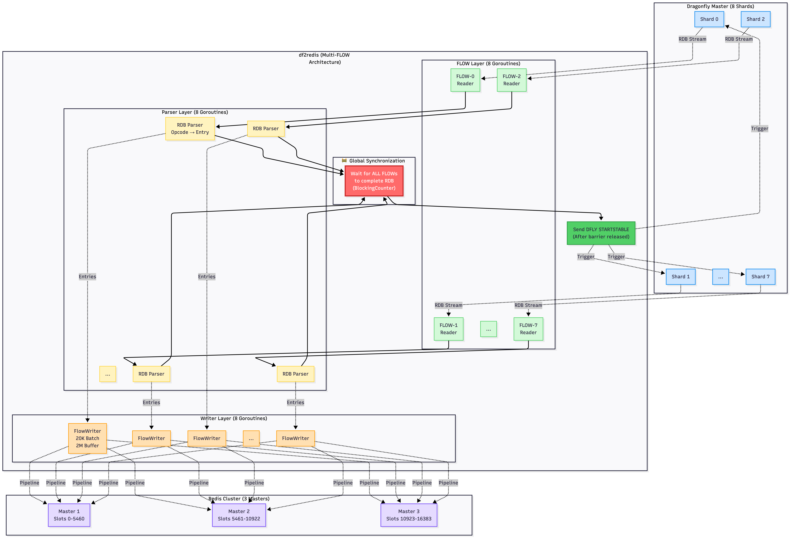

# Multi-FLOW Parallel Architecture

df2redis implements a fully parallel, multi-FLOW architecture that matches Dragonfly's shard-based design for maximum throughput.

## Overview



```
Dragonfly Master (N Shards)
    │
    ├─ Shard 0 ────► FLOW-0 ────► Parser-0 ────► Writer-0 ─┐
    ├─ Shard 1 ────► FLOW-1 ────► Parser-1 ────► Writer-1 ─┤
    ├─ Shard 2 ────► FLOW-2 ────► Parser-2 ────► Writer-2 ─┤
    ├─ Shard 3 ────► FLOW-3 ────► Parser-3 ────► Writer-3 ─┤
    ├─ Shard 4 ────► FLOW-4 ────► Parser-4 ────► Writer-4 ─┼─► Redis Cluster
    ├─ Shard 5 ────► FLOW-5 ────► Parser-5 ────► Writer-5 ─┤
    ├─ Shard 6 ────► FLOW-6 ────► Parser-6 ────► Writer-6 ─┤
    └─ Shard 7 ────► FLOW-7 ────► Parser-7 ────► Writer-7 ─┘
                         │             │              │
                         │             │              │
                    TCP Stream    RDB Decoder    Batch Writer
                                   Journal         Pipeline
                                   Decoder
```

## Design Rationale

### Why Multi-FLOW?

1. **Parallelism**: Dragonfly shards data across multiple threads. Single-connection replication would create a bottleneck.

2. **Ordering**: Each shard maintains its own ordering guarantees. Mixing data from multiple shards in one stream would complicate LSN tracking.

3. **Performance**: Multiple parallel streams can saturate network bandwidth and leverage multi-core CPUs.

4. **Scalability**: FLOW count scales with Dragonfly's shard count (configurable, typically matching N).

## Architecture Layers

### Layer 1: FLOW Connection Manager

**Responsibility**: Establish and maintain TCP connections to Dragonfly.

```go
type FLOWConnection struct {
    ID        int
    Conn      net.Conn
    SessionID string
    Reader    *bufio.Reader
}

func (r *Replicator) setupFLOWs(numFlows int) ([]*FLOWConnection, error) {
    flows := make([]*FLOWConnection, numFlows)

    for i := 0; i < numFlows; i++ {
        conn, err := net.Dial("tcp", r.config.Source.Addr)
        if err != nil {
            return nil, fmt.Errorf("FLOW-%d: connection failed: %w", i, err)
        }

        // Set TCP parameters for high throughput
        if tcpConn, ok := conn.(*net.TCPConn); ok {
            tcpConn.SetReadBuffer(10 * 1024 * 1024)  // 10MB
            tcpConn.SetKeepAlive(true)
            tcpConn.SetKeepAlivePeriod(15 * time.Second)
        }

        // Send DFLY FLOW command
        resp, err := redisx.Do(conn, "DFLY", "FLOW", strconv.Itoa(i), "1.0")
        sessionID := parseSessionID(resp)

        flows[i] = &FLOWConnection{
            ID:        i,
            Conn:      conn,
            SessionID: sessionID,
            Reader:    bufio.NewReaderSize(conn, 1024*1024),
        }

        log.Infof("[FLOW-%d] Connected, session: %s", i, sessionID)
    }

    return flows, nil
}
```

### Layer 2: RDB Parser (Per-FLOW)

**Responsibility**: Decode RDB stream into structured entries.

```go
func (r *Replicator) parseRDBStream(flowID int, conn *FLOWConnection) error {
    parser := NewRDBParser(conn.Reader)

    for {
        opcode, err := parser.ReadByte()
        if err != nil {
            return fmt.Errorf("[FLOW-%d] read opcode failed: %w", flowID, err)
        }

        if opcode == RDB_OPCODE_FULLSYNC_END {
            log.Infof("[FLOW-%d] RDB phase complete", flowID)
            break
        }

        entry, err := parser.ParseEntry(opcode)
        if err != nil {
            return fmt.Errorf("[FLOW-%d] parse entry failed: %w", flowID, err)
        }

        // Send to writer
        r.writers[flowID].Enqueue(entry)
    }

    return nil
}
```

### Layer 3: Writer (Per-FLOW)

**Responsibility**: Batch entries and write to Redis.

```go
type FlowWriter struct {
    flowID      int
    entryChan   chan *RDBEntry
    batchSize   int
    clusterClient *cluster.Client
}

func (fw *FlowWriter) batchWriteLoop() {
    batch := make([]*RDBEntry, 0, fw.batchSize)
    ticker := time.NewTicker(5 * time.Second)

    for {
        select {
        case entry := <-fw.entryChan:
            batch = append(batch, entry)

            if len(batch) >= fw.batchSize {
                fw.flushBatch(batch)
                batch = make([]*RDBEntry, 0, fw.batchSize)
            }

        case <-ticker.C:
            if len(batch) > 0 {
                fw.flushBatch(batch)
                batch = make([]*RDBEntry, 0, fw.batchSize)
            }
        }
    }
}
```

## Global Synchronization Barrier

### Problem

Dragonfly requires all FLOWs to complete RDB phase before entering stable sync. If `DFLY STARTSTABLE` is sent too early:
- Some FLOWs are still receiving RDB data
- Those FLOWs will miss writes that occur during the transition
- Data inconsistency

### Solution: Blocking Counter Pattern

Inspired by Dragonfly's `BlockingCounter` implementation.

```go
// Global barrier
rdbCompletionBarrier := make(chan struct{})
var rdbCompleteCount atomic.Int32

// Each FLOW goroutine
for i := 0; i < numFlows; i++ {
    go func(flowID int) {
        // Parse RDB stream
        err := r.parseRDBStream(flowID, flows[flowID])
        if err != nil {
            log.Errorf("[FLOW-%d] RDB parsing failed: %v", flowID, err)
            return
        }

        // Read EOF token
        err = r.consumeEOFToken(flows[flowID])
        if err != nil {
            log.Errorf("[FLOW-%d] EOF token failed: %v", flowID, err)
            return
        }

        // Signal completion
        completed := rdbCompleteCount.Add(1)
        log.Infof("[FLOW-%d] RDB phase complete (%d/%d)", flowID, completed, numFlows)

        // Last FLOW closes the barrier
        if completed == int32(numFlows) {
            log.Info("🚧 All FLOWs completed RDB, releasing barrier")
            close(rdbCompletionBarrier)
        }

        // Wait for barrier (synchronize all FLOWs)
        <-rdbCompletionBarrier
        log.Infof("[FLOW-%d] Barrier released, entering stable sync", flowID)

        // Parse journal stream
        r.parseJournalStream(flowID, flows[flowID])
    }(i)
}

// Main goroutine waits for all FLOWs to synchronize
<-rdbCompletionBarrier
log.Info("Sending DFLY STARTSTABLE")
r.masterConn.Do("DFLY", "STARTSTABLE", stableSessionID, "0")
```

### Visualization

```
Time ─────────────────────────────────────────────►

FLOW-0  [RDB Parsing.......] ┤ Wait ├ [Journal Stream...]
FLOW-1  [RDB Parsing..........] ┤ Wt ├ [Journal Stream...]
FLOW-2  [RDB Parsing.....] ┤ Wait   ├ [Journal Stream...]
FLOW-3  [RDB Parsing........] ┤ Wait ├ [Journal Stream...]
FLOW-4  [RDB Parsing......] ┤ Wait  ├ [Journal Stream...]
FLOW-5  [RDB Parsing...........] ┤ W ├ [Journal Stream...]
FLOW-6  [RDB Parsing.........] ┤ Wai├ [Journal Stream...]
FLOW-7  [RDB Parsing..............] ├ [Journal Stream...]
                                    │
                                    └─ Barrier releases here
                                       (when FLOW-7 completes)
```

## Concurrency Control

### Channel Buffering

Each writer has a 2M entry buffer to absorb bursts:

```go
entryChan := make(chan *RDBEntry, 2000000)
```

**Sizing rationale**:
- Average entry size: ~1KB
- Buffer capacity: 2M entries × 1KB = 2GB per FLOW
- Total memory: N FLOWs × 2GB = 16GB

### Semaphore-Based Batch Limiting

Prevent too many concurrent write operations:

```go
type FlowWriter struct {
    writeSemaphore chan struct{}  // Max concurrent batches
}

func NewFlowWriter(maxConcurrent int) *FlowWriter {
    return &FlowWriter{
        writeSemaphore: make(chan struct{}, maxConcurrent),
    }
}

func (fw *FlowWriter) flushBatch(batch []*RDBEntry) {
    // Acquire semaphore slot
    fw.writeSemaphore <- struct{}{}

    go func() {
        defer func() { <-fw.writeSemaphore }()  // Release slot

        // Write batch to Redis
        fw.writeBatchToRedis(batch)
    }()
}
```

## Performance Characteristics

### Throughput

**Full Sync (RDB Phase)**:
- Per-FLOW: ~12,000 ops/sec
- Total (N FLOWs): ~96,000 ops/sec

**Stable Sync (Journal Phase)**:
- Per-FLOW: ~5,000 ops/sec (limited by source write rate)
- Total (N FLOWs): ~40,000 ops/sec

### Latency

- **RDB parsing**: <0.1ms per entry
- **Batch accumulation**: 5000ms (configurable, cluster mode)
- **Redis write (pipeline)**: 5-20ms per batch (500 entries)
- **End-to-end**: <50ms from Dragonfly write to Redis acknowledgment

### Resource Usage

| Resource | Per-FLOW | Total (N FLOWs) |
|----------|----------|-----------------|
| Memory | 2GB | 16GB |
| CPU | ~50% | ~400% |
| Network | 10-50 MB/s | 80-400 MB/s |
| Goroutines | 2 (parser + writer) | 16 |

## Failure Handling

### FLOW-Level Failures

If a single FLOW fails:
- Log the error and mark FLOW as failed
- Continue processing other FLOWs
- Entire replication fails only if critical threshold exceeded (e.g., >25% failed)

```go
var failedFlows atomic.Int32

go func(flowID int) {
    if err := r.parseRDBStream(flowID, flows[flowID]); err != nil {
        log.Errorf("[FLOW-%d] Failed: %v", flowID, err)
        failedFlows.Add(1)

        if failedFlows.Load() > int32(numFlows/4) {
            log.Fatal("Too many FLOWs failed, aborting replication")
        }
        return
    }
}(i)
```

### Network Interruptions

- TCP keepalive (15s) detects dead connections
- Automatic reconnection with exponential backoff
- Resume from last checkpoint LSN

### Barrier Deadlock Prevention

If one FLOW hangs, the barrier will never close. Prevention:

```go
// Timeout-based barrier
select {
case <-rdbCompletionBarrier:
    log.Info("All FLOWs completed normally")
case <-time.After(10 * time.Minute):
    log.Fatal("RDB phase timeout (10m), some FLOWs may be stuck")
}
```

## Monitoring

### Per-FLOW Metrics

```go
type FLOWStats struct {
    TotalEntries  int64
    TotalBytes    int64
    ErrorCount    int64
    LastActivityTime time.Time
}

// Export to Prometheus
flowEntriesTotal.WithLabelValues(strconv.Itoa(flowID)).Add(float64(count))
flowBytesTotal.WithLabelValues(strconv.Itoa(flowID)).Add(float64(bytes))
```

### Health Checks

Detect stuck FLOWs:

```go
func (r *Replicator) monitorFLOWHealth() {
    ticker := time.NewTicker(30 * time.Second)
    for range ticker.C {
        for i, stats := range r.flowStats {
            if time.Since(stats.LastActivityTime) > 60*time.Second {
                log.Warnf("[FLOW-%d] No activity for 60s, may be stuck", i)
            }
        }
    }
}
```

## Best Practices

1. **Match Dragonfly's shard count**: Use the same number of FLOWs as Dragonfly shards.
2. **Size buffers appropriately**: 2M entries per FLOW is a good balance for 1-10M key datasets.
3. **Monitor barrier timing**: If barrier takes >5 minutes, investigate slow FLOWs.
4. **Use structured logging**: Include FLOW-ID in all log messages for easier debugging.

## Further Reading

- [Replication Protocol](replication-protocol.md)
- [Data Pipeline & Backpressure](data-pipeline.md)
- [Performance Tuning Guide](../guides/performance-tuning.md)
