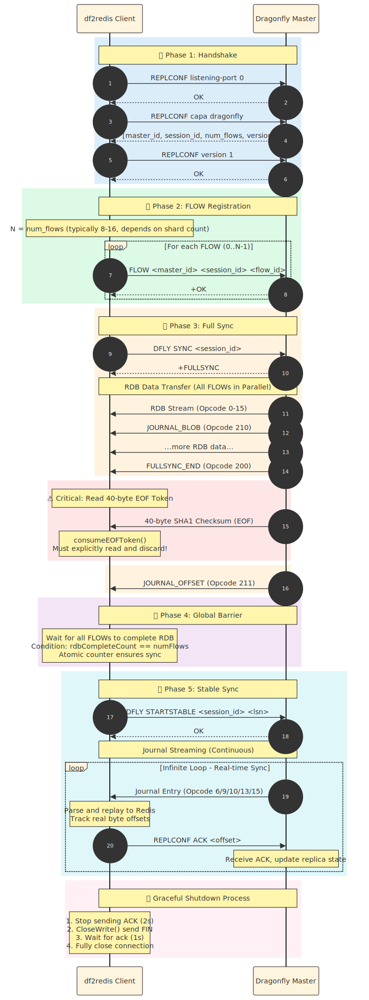

# Dragonfly Replication Protocol

This document provides a detailed breakdown of Dragonfly's replication protocol and how df2redis implements it.

## Protocol Overview

Dragonfly uses a custom replication protocol designed for high-performance, shard-aware data synchronization. The protocol consists of five distinct phases:

1. **Handshake**: Capability negotiation
2. **FLOW Registration**: Create per-shard connections
3. **Full Sync**: RDB snapshot transfer
4. **Global Barrier**: Synchronize all FLOWs
5. **Stable Sync**: Continuous journal streaming

## Phase 1: Handshake

### Purpose
Negotiate replication capabilities and versions between replica and master.

### Commands

```
Client → Server: REPLCONF listening-port 0
Server → Client: OK

Client → Server: REPLCONF capa dragonfly
Server → Client: OK

Client → Server: REPLCONF version 1
Server → Client: OK
```

### Implementation

```go
// Send REPLCONF commands
func (r *Replicator) handshake() error {
    cmds := [][]string{
        {"REPLCONF", "listening-port", "0"},
        {"REPLCONF", "capa", "dragonfly"},
        {"REPLCONF", "version", "1"},
    }

    for _, cmd := range cmds {
        resp, err := r.masterConn.Do(cmd[0], cmd[1:]...)
        if err != nil || resp != "OK" {
            return fmt.Errorf("handshake failed: %v", err)
        }
    }

    return nil
}
```

## Phase 2: FLOW Registration

### Purpose
Create one TCP connection per Dragonfly shard for parallel data transfer.

### Sequence Diagram




```
Client                   Dragonfly Master
  │                            │
  ├─ REPLCONF ... ────────────►│  Phase 1: Handshake
  │◄──────────────────── OK ───┤
  │                            │
  ├─ DFLY FLOW 0 1.0 ─────────►│  Phase 2: Register FLOW-0
  │◄────── +<session-0> ───────┤
  │                            │
  ├─ DFLY FLOW 1 1.0 ─────────►│  Register FLOW-1
  │◄────── +<session-1> ───────┤
  │                            │
  │          ... (FLOW 2-7)    │
  │                            │
  ├─ DFLY SYNC <sid> ─────────►│  Phase 3: Request full sync
  │◄────── +FULLSYNC ──────────┤
  │                            │
  │◄─── RDB Stream (all FLOWs) │  Receive RDB data
  │◄─── Opcode 200 (END) ──────┤
  │◄─── 40-byte EOF Token ─────┤  ⚠️ Must read & discard!
  │◄─── Opcode 211 (OFFSET) ───┤
  │                            │
  │    [Wait for all FLOWs]    │  Phase 4: Global Barrier
  │                            │
  ├─ DFLY STARTSTABLE ────────►│  Phase 5: Enter stable sync
  │◄────── OK ─────────────────┤
  │                            │
  │◄─── Journal Stream ────────┤  Continuous journal entries
  │◄─────────────────────────  │  (infinite loop)
```

### FLOW Command Format

```
DFLY FLOW <flow-id> <protocol-version>
```

- `flow-id`: 0-based index (0 to N-1 for N shards)
- `protocol-version`: Currently "1.0"

### Response

```
+<session-id>
```

The session ID is used later in `DFLY SYNC` to establish the full sync context.

### Implementation

```go
// Create FLOW connections
func (r *Replicator) setupFLOWs() error {
    numFlows := r.detectShardCount()  // Usually matches source shard count

    for i := 0; i < numFlows; i++ {
        conn, err := net.Dial("tcp", r.masterAddr)
        if err != nil {
            return err
        }

        // Send DFLY FLOW command
        resp, err := conn.Do("DFLY", "FLOW", strconv.Itoa(i), "1.0")
        if err != nil {
            return err
        }

        // Parse session ID
        sessionID := parseSessionID(resp)
        r.flowSessions[i] = sessionID
        r.flowConns[i] = conn
    }

    return nil
}
```

## Phase 3: Full Sync (RDB Transfer)

### Request

```
DFLY SYNC <stable-session-id>
```

The `stable-session-id` is typically the session ID from FLOW-0.

### Response

```
+FULLSYNC
```

Followed by RDB stream on **all FLOW connections simultaneously**.

### RDB Stream Format

Each FLOW sends a sequence of RDB entries:

```
[Opcode (1 byte)] [Type-specific data (variable length)]
```

#### Standard RDB Opcodes (0-15)

| Opcode | Type | Description |
|--------|------|-------------|
| 0 | String | Simple key-value |
| 1 | List | Linked list |
| 2 | Set | Unordered set |
| 3 | Sorted Set | Ordered set with scores |
| 4 | Hash | Hash map |
| 14 | Hash Ziplist | Compressed hash |
| 15 | ZSet Ziplist | Compressed sorted set |

#### Dragonfly Extensions (200+)

| Opcode | Name | Description |
|--------|------|-------------|
| 200 | FULLSYNC_END | Marks end of RDB phase |
| 210 | JOURNAL_BLOB | Inline journal entries during RDB |
| 211 | JOURNAL_OFFSET | LSN synchronization marker |

### Critical: EOF Token Handling

**After receiving `Opcode 200 (FULLSYNC_END)`, Dragonfly sends a 40-byte SHA1 checksum.**

⚠️ **This is a legacy EOF token that MUST be read and discarded.**

#### Why This Matters

If you don't read the EOF token:
- The 40 bytes remain in the TCP buffer
- The journal parser reads them as journal opcodes
- Common errors: `unknown opcode: 100 ('d')`, `unknown opcode: 53 ('5')`
  - These are ASCII characters from the SHA1 hex string (e.g., "d56ef2...")

#### Correct Implementation

```go
func (r *Replicator) consumeEOFToken() error {
    log.Info("Reading EOF Token (40-byte SHA1 checksum)")

    eofToken := make([]byte, 40)
    _, err := io.ReadFull(r.conn, eofToken)
    if err != nil {
        return fmt.Errorf("failed to read EOF token: %w", err)
    }

    log.Debugf("EOF Token: %s", string(eofToken))
    return nil
}
```

## Phase 4: Global Synchronization Barrier

### Purpose
Ensure all FLOWs complete their RDB phase before entering stable sync.

### Why It's Necessary

Dragonfly's master expects **all FLOWs to reach the stable sync point simultaneously**. If `DFLY STARTSTABLE` is sent prematurely:
- Some FLOWs are still receiving RDB data
- Those FLOWs will miss the transition
- Data loss occurs during the handoff window

### Implementation Pattern

```go
// Global barrier using blocking counter
rdbCompletionBarrier := make(chan struct{})
var rdbCompleteCount atomic.Int32

// Each FLOW goroutine
go func(flowID int) {
    // ... parse RDB stream ...

    // Read until FULLSYNC_END
    for opcode != RDB_OPCODE_FULLSYNC_END {
        entry := parseRDBEntry()
        writer.Enqueue(entry)
    }

    // Signal completion
    completed := rdbCompleteCount.Add(1)
    log.Infof("[FLOW-%d] RDB phase complete (%d/%d)", flowID, completed, numFlows)

    if completed == int32(numFlows) {
        close(rdbCompletionBarrier)  // Last FLOW triggers
    }
}

// Main goroutine waits
<-rdbCompletionBarrier
log.Info("All FLOWs completed RDB phase, sending STARTSTABLE")
```

## Phase 5: Stable Sync (Journal Streaming)

### Command

```
DFLY STARTSTABLE <stable-session-id> <lsn>
```

- `lsn`: Logical Sequence Number to resume from (0 for fresh start)

### Response

```
OK
```

After this, Dragonfly starts streaming journal entries on all FLOW connections.

### Journal Entry Format

```
[Opcode (1 byte)] [Entry Data (variable length)]
```

#### Journal Opcodes

| Opcode | Name | Description |
|--------|------|-------------|
| 0 | NOOP | No operation (heartbeat) |
| 6 | SELECT | Switch database (SELECT <dbid>) |
| 9 | EXPIRED | Key expiration event |
| 10 | COMMAND | Redis command to replay |
| 13 | PING | Keep-alive ping |
| 15 | LSN | LSN checkpoint marker |

#### COMMAND Entry Structure (Opcode 10)

```
[LSN (8 bytes)]
[TxID (8 bytes)]
[ShardCnt (4 bytes)]
[DbID (2 bytes)]
[Command Args (variable length)]
  - Array of bulk strings: ["SET", "key", "value"]
```

### Implementation

```go
func (r *Replicator) parseJournalEntry() (*JournalEntry, error) {
    opcode, err := r.reader.ReadUInt8()
    if err != nil {
        return nil, err
    }

    switch opcode {
    case 6: // SELECT
        dbID, _ := r.reader.ReadUInt16()
        return &JournalEntry{Opcode: SELECT, DbID: dbID}, nil

    case 10: // COMMAND
        lsn, _ := r.reader.ReadUInt64()
        txID, _ := r.reader.ReadUInt64()
        shardCnt, _ := r.reader.ReadUInt32()
        dbID, _ := r.reader.ReadUInt16()

        // Read command args
        args := r.reader.ReadBulkStringArray()

        return &JournalEntry{
            Opcode:   COMMAND,
            LSN:      lsn,
            TxID:     txID,
            ShardCnt: shardCnt,
            DbID:     dbID,
            Args:     args,
        }, nil

    case 13: // PING
        return &JournalEntry{Opcode: PING}, nil

    case 15: // LSN
        lsn, _ := r.reader.ReadUInt64()
        return &JournalEntry{Opcode: LSN, LSN: lsn}, nil

    default:
        return nil, fmt.Errorf("unknown journal opcode: %d", opcode)
    }
}
```

## Error Handling

### Common Errors

#### 1. "unknown opcode: 100" (or 53, 54, etc.)

**Cause**: EOF token (40-byte checksum) not consumed.

**Solution**: Call `consumeEOFToken()` after `FULLSYNC_END`.

#### 2. "connection reset by peer"

**Cause**: TCP keepalive timeout (Dragonfly default: 30s).

**Solution**: Set larger receive buffer and implement periodic PING replies.

```go
// Increase TCP receive buffer to 10MB
tcpConn.SetReadBuffer(10 * 1024 * 1024)

// Enable TCP keepalive
tcpConn.SetKeepAlive(true)
tcpConn.SetKeepAlivePeriod(15 * time.Second)
```

#### 3. "FLOW x still in RDB phase"

**Cause**: Global barrier released prematurely.

**Solution**: Ensure atomic counter matches `numFlows` before closing barrier.

## Performance Considerations

### Parallel RDB Parsing
- N FLOWs × N parser goroutines = N*N concurrent operations
- Memory: ~16GB (N × 2M entries × 1KB/entry)

### TCP Buffering
- Default: 4KB (too small for high-throughput streams)
- Recommended: 1MB per FLOW
```go
reader := bufio.NewReaderSize(conn, 1024*1024)
```

### Checkpoint Frequency
- Save LSN every 10 seconds (configurable)
- Balance between recovery time and disk I/O

## Further Reading

- [Multi-FLOW Architecture](multi-flow.md)
- [RDB Parser Implementation](../development/rdb-parser.md)
- [Journal Parser Implementation](../development/journal-parser.md)
