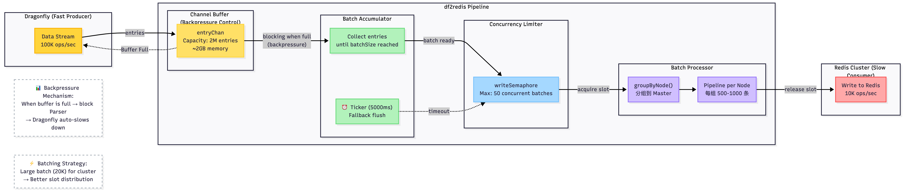

# 数据流水线与背压控制

本文档解释 df2redis 的数据流水线架构，以及如何处理 Dragonfly（快速）和 Redis（较慢）之间的速度不匹配问题。

## 速度不匹配问题

```
Dragonfly (源端)     df2redis (流水线)     Redis Cluster (目标端)
  100K ops/sec    ────►   ?????  ────►   10K ops/sec
     (快速)                              (较慢)
```

**挑战**：如果没有适当的缓冲和背压控制：
- 内存耗尽（OOM）
- Goroutine 爆炸
- TCP 缓冲区溢出

## 流水线架构

<!-- 🖼️ 数据流水线架构图占位符 -->
<!-- 替换为：docs/images/architecture/data-pipeline.png -->


```
┌──────────────────────────────────────────────────────────────────┐
│                   Dragonfly (快速生产者)                         │
│                      ~100,000 ops/sec                            │
└─────────────────────────────────┬────────────────────────────────┘
                                  │
                                  │ RDB/Journal Stream
                                  ▼
                      ┌───────────────────────┐
                      │   RDB/Journal Parser  │
                      │    (8 goroutines)     │
                      └───────────┬───────────┘
                                  │
                                  │ Parsed Entries
                                  ▼
┌──────────────────────────────────────────────────────────────────┐
│                    Channel Buffer (背压控制)                     │
│                                                                  │
│  entryChan := make(chan *RDBEntry, 2000000)                      │
│                                                                  │
│  容量：2M 条目 × 1KB/条目 = 每个 FLOW 2GB                        │
│  总计：8 FLOWs × 2GB = 16GB 内存                                 │
│                                                                  │
│  当缓冲区满时 → Parser 阻塞 → Dragonfly 减速                     │
└─────────────────────────────────┬────────────────────────────────┘
                                  │
                                  │ Buffered Entries
                                  ▼
                      ┌───────────────────────┐
                      │  批次累积器           │
                      │                       │
                      │  收集条目直到         │
                      │  达到 batchSize       │
                      │  (集群模式 20K)       │
                      │                       │
                      │  ⏰ Ticker: 5000ms     │
                      │  (备用刷新)           │
                      └───────────┬───────────┘
                                  │
                                  │ Full Batch
                                  ▼
                      ┌───────────────────────┐
                      │  并发限制器           │
                      │                       │
                      │  Semaphore:           │
                      │  max 50 batches       │
                      └───────────┬───────────┘
                                  │
                                  │ Acquire Slot
                                  ▼
                      ┌───────────────────────┐
                      │  批次处理器           │
                      │                       │
                      │  groupByNode()        │
                      │  → 3 个节点分组       │
                      └───────────┬───────────┘
                                  │
                                  │ Grouped Commands
                                  ▼
                      ┌───────────────────────┐
                      │  Pipeline 执行器      │
                      │                       │
                      │  3 个 Pipeline        │
                      │  (每个 ~666 个命令)   │
                      └───────────┬───────────┘
                                  │
                                  │ Redis Commands
                                  ▼
┌──────────────────────────────────────────────────────────────────┐
│                 Redis Cluster (慢速消费者)                       │
│                       ~10,000 ops/sec                            │
└──────────────────────────────────────────────────────────────────┘
```

## 组件详解

### 1. Channel 缓冲区（背压控制）

**目的**：吸收突发流量，并在目标比源慢时提供背压。

```go
type FlowWriter struct {
    entryChan chan *RDBEntry  // Buffered channel
}

func NewFlowWriter(flowID int) *FlowWriter {
    return &FlowWriter{
        entryChan: make(chan *RDBEntry, 2000000),  // 2M buffer
    }
}
```

#### 背压工作原理

```go
// 生产者（Parser）- 缓冲区满时阻塞
func (p *Parser) Enqueue(entry *RDBEntry) {
    p.writer.entryChan <- entry  // 如果 Channel 满了会阻塞
}

// 消费者（Writer）- 始终在排空
func (w *FlowWriter) batchWriteLoop() {
    for entry := range w.entryChan {
        // Process entry
    }
}
```

**背压链**：
```
Redis 慢 → Writer 慢 → Channel 填满 → Parser 阻塞 →
TCP 缓冲区填满 → Dragonfly 检测到满缓冲区 → Dragonfly 减速
```

#### 缓冲区大小设计

```
平均条目大小：1KB
缓冲区容量：2M 条目
每个 FLOW 内存：2M × 1KB = 2GB
总计（8 FLOWs）：16GB

为什么是 2M？
- 足够大：吸收 10-20 秒的突发流量
- 足够小：适合典型服务器内存（64-128GB）
```

### 2. 批次累积器

**目的**：将条目收集到大批次中，以实现高效的 Pipeline 执行。

```go
func (fw *FlowWriter) batchWriteLoop() {
    batch := make([]*RDBEntry, 0, fw.batchSize)
    ticker := time.NewTicker(fw.flushInterval)
    defer ticker.Stop()

    for {
        select {
        case entry, ok := <-fw.entryChan:
            if !ok {
                // Channel closed, flush remaining
                if len(batch) > 0 {
                    fw.flushBatch(batch)
                }
                return
            }

            batch = append(batch, entry)

            // Flush when batch is full
            if len(batch) >= fw.batchSize {
                fw.flushBatch(batch)
                batch = make([]*RDBEntry, 0, fw.batchSize)
            }

        case <-ticker.C:
            // Periodic flush for incomplete batches
            if len(batch) > 0 {
                fw.flushBatch(batch)
                batch = make([]*RDBEntry, 0, fw.batchSize)
            }
        }
    }
}
```

#### 批处理策略

| 模式 | 批次大小 | 刷新间隔 | 原因 |
|------|-----------|----------------|-----------|
| **集群模式** | 20,000 | 5000ms | Slot 分组需要大批次 |
| **单机模式** | 2,000 | 50ms | 无 Slot 碎片，优先考虑延迟 |

### 3. 并发限制器（信号量）

**目的**：防止过多并发批次压垮系统。

```go
type FlowWriter struct {
    writeSemaphore chan struct{}  // Semaphore
    maxConcurrent  int
}

func NewFlowWriter(maxConcurrent int) *FlowWriter {
    return &FlowWriter{
        writeSemaphore: make(chan struct{}, maxConcurrent),
        maxConcurrent:  maxConcurrent,
    }
}

func (fw *FlowWriter) flushBatch(batch []*RDBEntry) {
    // Acquire semaphore slot (blocks if limit reached)
    fw.writeSemaphore <- struct{}{}

    // Process batch asynchronously
    go func(b []*RDBEntry) {
        defer func() { <-fw.writeSemaphore }()  // Release slot

        fw.writeBatchToRedis(b)
    }(batch)
}
```

#### 并发调优

```
单机模式：
- maxConcurrent = 50（高并行度）
- 总 Goroutine：50 × 8 FLOWs = 400

集群模式：
- maxConcurrent = 400 / numFlows = 50
- 总 Goroutine：50 × 8 FLOWs = 400
```

### 4. 基于节点的分组

详见 [集群路由优化](cluster-routing.md)。

```go
func (fw *FlowWriter) groupByNode(batch []*RDBEntry) map[string][]*RDBEntry {
    groups := make(map[string][]*RDBEntry)

    for _, entry := range batch {
        slot := crc16(entry.Key) % 16384
        masterAddr := fw.clusterClient.MasterAddrForSlot(slot)
        groups[masterAddr] = append(groups[masterAddr], entry)
    }

    return groups  // 3 个主节点产生 3 个分组
}
```

### 5. Pipeline 执行

```go
func (fw *FlowWriter) writeNodeGroup(masterAddr string, entries []*RDBEntry) {
    // Build commands
    cmds := make([][]interface{}, 0, len(entries))
    for _, entry := range entries {
        cmd := fw.buildCommand(entry)
        cmds = append(cmds, cmd)
    }

    // Execute pipeline
    conn := fw.clusterClient.GetConnectionForMaster(masterAddr)
    results, err := conn.Pipeline(cmds)

    // Handle results
    for i, result := range results {
        if isError(result) {
            log.Errorf("Command %d failed: %v", i, result)
        }
    }
}
```

## 流量控制机制

### 1. Channel 阻塞（主要背压）

```go
// 当 Channel 满时，Parser goroutine 阻塞
func (p *Parser) parseRDBStream() {
    for {
        entry := p.readNextEntry()

        // 这一行在 Channel 满时阻塞
        p.writer.entryChan <- entry
    }
}
```

### 2. 信号量限制（并发控制）

```go
// 当信号量满时，批次刷新等待
func (fw *FlowWriter) flushBatch(batch []*RDBEntry) {
    // 这一行在有 maxConcurrent 个批次正在处理时阻塞
    fw.writeSemaphore <- struct{}{}

    go fw.writeBatchToRedis(batch)
}
```

### 3. TCP 缓冲（操作系统级别背压）

```go
// 增加 TCP 接收缓冲区以吸收突发
if tcpConn, ok := conn.(*net.TCPConn); ok {
    tcpConn.SetReadBuffer(10 * 1024 * 1024)  // 10MB
}
```

## 性能特性

### 吞吐量

**全量同步**：
```
Parser 吞吐量：~150K ops/sec（8 FLOWs × 每个 18K）
Writer 吞吐量：~100K ops/sec（受 Redis 限制）
缓冲区吸收差异
```

**稳定同步**：
```
Journal 速率：~40K ops/sec（典型工作负载）
Writer 吞吐量：~100K ops/sec
无需缓冲，Channel 几乎保持空闲
```

### 延迟

**端到端**：
```
条目到达 → Parser (0.1ms) → Buffer (0ms) → Accumulator (5000ms) →
Semaphore (10ms) → Pipeline (20ms) → Redis (5ms) = ~5035ms
```

**关键路径**：累积器等待时间（集群模式 5000ms）

### 内存使用

```
Channel 缓冲区：8 FLOWs × 2GB = 16GB
批次暂存：8 × 20K × 1KB = 160MB
总计：~16GB（正常负载下）
```

## 监控

### 关键指标

```go
// Channel 利用率
channelUtilization = len(entryChan) / cap(entryChan)

// Semaphore 利用率
semaphoreUtilization = len(writeSemaphore) / cap(writeSemaphore)

// 批次累积时间
batchWaitTime = time.Since(batchStartTime)
```

### 健康指标

| 指标 | 健康 | 警告 | 严重 |
|--------|---------|---------|----------|
| Channel 利用率 | <50% | 50-80% | >80% |
| Semaphore 利用率 | <70% | 70-90% | >90% |
| 批次等待时间 | <5s | 5-10s | >10s |

### Dashboard 集成

```go
// Export metrics to Prometheus
pipelineChannelUtilization.Set(float64(len(entryChan)) / float64(cap(entryChan)))
pipelineActiveBatches.Set(float64(len(writeSemaphore)))
pipelineBatchWaitTime.Observe(batchWaitTime.Seconds())
```

## 故障排查

### 问题：高内存使用 (>20GB)

**诊断**：
```bash
# Check channel depth
grep "channel.*full" log/replicate.log
```

**解决方案**：
1. 减少 Channel 缓冲区大小（2M → 1M）
2. 增加 Redis 目标容量
3. 减少批次大小（20K → 10K）

### 问题：低吞吐量 (<10K ops/sec)

**诊断**：
```bash
# Check batch sizes
grep "Flushing batch" log/replicate.log | awk '{print $NF}'
```

**解决方案**：
1. 增加批次大小（2K → 20K，集群模式）
2. 增加 maxConcurrent（50 → 100）
3. 检查 Redis Cluster 健康状况

### 问题：Parser 阻塞

**诊断**：
```bash
# Check if parser is stuck
grep "Parser blocked" log/replicate.log
```

**原因**：Channel 满，Writer 无法跟上。

**解决方案**：
1. 检查 Redis 健康状况（慢查询、高负载）
2. 增加 maxConcurrent
3. 扩展 Redis Cluster（添加更多 Master）

## 最佳实践

1. **适当调整缓冲区大小**：对于 1-10M 键的数据集，2M 条目是一个良好的默认值。

2. **监控 Channel 利用率**：如果持续 >80%，增加缓冲区或提高 Writer 吞吐量。

3. **根据模式调整批次大小**：
   - 集群模式：20K（用于 Slot 分组）
   - 单机模式：2K（用于更低延迟）

4. **调整刷新间隔**：
   - 全量同步：长间隔（5000ms）以最大化批次大小
   - 稳定同步：短间隔（50ms）以实现实时复制

5. **使用结构化日志**：在所有日志消息中包含 FLOW-ID、批次大小和时序。

## 延伸阅读

- [多 FLOW 架构](multi-flow.md)
- [集群路由优化](cluster-routing.md)
- [性能调优指南](../guides/performance-tuning.md)
