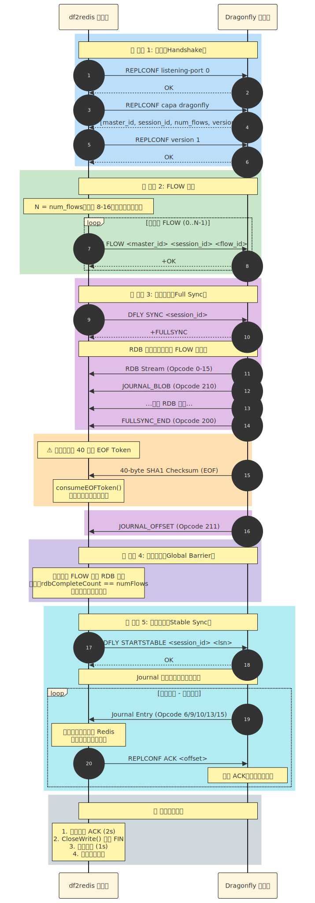

# Dragonfly 复制协议深度解析

本文档详细解析 Dragonfly 的复制协议以及 df2redis 的实现方式。

## 协议概览

Dragonfly 使用自定义复制协议，专为高性能、分片感知的数据同步设计。协议包含五个不同阶段：

1. **握手（Handshake）**：能力协商
2. **FLOW 注册**：创建每个分片的连接
3. **全量同步（Full Sync）**：RDB 快照传输
4. **全局屏障（Global Barrier）**：同步所有 FLOW
5. **稳定同步（Stable Sync）**：持续的 Journal 流

## 阶段 1：握手

### 目的
在副本和主节点之间协商复制能力和版本。

### 命令序列

```
Client → Server: REPLCONF listening-port 0
Server → Client: OK

Client → Server: REPLCONF capa dragonfly
Server → Client: OK

Client → Server: REPLCONF version 1
Server → Client: OK
```

### 实现代码

```go
// Send REPLCONF commands
func (r *Replicator) handshake() error {
    cmds := [][]string{
        {"REPLCONF", "listening-port", "0"},
        {"REPLCONF", "capa", "dragonfly"},
        {"REPLCONF", "version", "1"},
    }

    for _, cmd := range cmds {
        resp, err := r.masterConn.Do(cmd[0], cmd[1:]...)
        if err != nil || resp != "OK" {
            return fmt.Errorf("handshake failed: %v", err)
        }
    }

    return nil
}
```

## 阶段 2：FLOW 注册

### 目的
为每个 Dragonfly 分片创建一个 TCP 连接，实现并行数据传输。

### 时序图



```
Client                   Dragonfly Master
  │                            │
  ├─ REPLCONF ... ────────────►│  阶段 1：握手
  │◄──────────────────── OK ───┤
  │                            │
  ├─ DFLY FLOW 0 1.0 ─────────►│  阶段 2：注册 FLOW-0
  │◄────── +<session-0> ───────┤
  │                            │
  ├─ DFLY FLOW 1 1.0 ─────────►│  注册 FLOW-1
  │◄────── +<session-1> ───────┤
  │                            │
  │          ... (FLOW 2-7)    │
  │                            │
  ├─ DFLY SYNC <sid> ─────────►│  阶段 3：请求全量同步
  │◄────── +FULLSYNC ──────────┤
  │                            │
  │◄─── RDB Stream (all FLOWs) │  接收 RDB 数据
  │◄─── Opcode 200 (END) ──────┤
  │◄─── 40-byte EOF Token ─────┤  ⚠️ 必须读取并丢弃！
  │◄─── Opcode 211 (OFFSET) ───┤
  │                            │
  │    [Wait for all FLOWs]    │  阶段 4：全局屏障
  │                            │
  ├─ DFLY STARTSTABLE ────────►│  阶段 5：进入稳定同步
  │◄────── OK ─────────────────┤
  │                            │
  │◄─── Journal Stream ────────┤  持续的 Journal 条目
  │◄─────────────────────────  │  (无限循环)
```

### FLOW 命令格式

```
DFLY FLOW <flow-id> <protocol-version>
```

- `flow-id`: 从 0 开始的索引 (0, 1, 2, ..., 7 表示 8 个分片)
- `protocol-version`: 当前为 "1.0"

### 响应格式

```
+<session-id>
```

Session ID 稍后会在 `DFLY SYNC` 中使用，用于建立全量同步上下文。

### 实现代码

```go
// Create FLOW connections
func (r *Replicator) setupFLOWs() error {
    numFlows := r.detectShardCount()  // 通常为 8

    for i := 0; i < numFlows; i++ {
        conn, err := net.Dial("tcp", r.masterAddr)
        if err != nil {
            return err
        }

        // Send DFLY FLOW command
        resp, err := conn.Do("DFLY", "FLOW", strconv.Itoa(i), "1.0")
        if err != nil {
            return err
        }

        // Parse session ID
        sessionID := parseSessionID(resp)
        r.flowSessions[i] = sessionID
        r.flowConns[i] = conn
    }

    return nil
}
```

## 阶段 3：全量同步（RDB 传输）

### 请求命令

```
DFLY SYNC <stable-session-id>
```

`stable-session-id` 通常是 FLOW-0 的 session ID。

### 响应

```
+FULLSYNC
```

之后在**所有 FLOW 连接上同时**开始 RDB 流传输。

### RDB 流格式

每个 FLOW 发送一系列 RDB 条目：

```
[Opcode (1 字节)] [类型相关数据 (变长)]
```

#### 标准 RDB Opcode (0-15)

| Opcode | 类型 | 描述 |
|--------|------|------|
| 0 | String | 简单键值对 |
| 1 | List | 链表 |
| 2 | Set | 无序集合 |
| 3 | Sorted Set | 有序集合 |
| 4 | Hash | 哈希表 |
| 14 | Hash Ziplist | 压缩哈希 |
| 15 | ZSet Ziplist | 压缩有序集合 |

#### Dragonfly 扩展 Opcode (200+)

| Opcode | 名称 | 描述 |
|--------|------|------|
| 200 | FULLSYNC_END | 标记 RDB 阶段结束 |
| 210 | JOURNAL_BLOB | RDB 期间的内联 Journal 条目 |
| 211 | JOURNAL_OFFSET | LSN 同步标记 |

### 关键：EOF Token 处理

**在接收到 `Opcode 200 (FULLSYNC_END)` 后，Dragonfly 会发送 40 字节的 SHA1 校验和。**

⚠️ **这是一个遗留的 EOF Token，必须被读取并丢弃。**

#### 为什么这很重要

如果不读取 EOF Token：
- 这 40 字节会留在 TCP 缓冲区中
- Journal Parser 会将它们当作 Journal Opcode 读取
- 常见错误：`unknown opcode: 100 ('d')`, `unknown opcode: 53 ('5')`
  - 这些是 SHA1 十六进制字符串中的 ASCII 字符（例如 "d56ef2..."）

#### 正确实现

```go
func (r *Replicator) consumeEOFToken() error {
    log.Info("Reading EOF Token (40-byte SHA1 checksum)")

    eofToken := make([]byte, 40)
    _, err := io.ReadFull(r.conn, eofToken)
    if err != nil {
        return fmt.Errorf("failed to read EOF token: %w", err)
    }

    log.Debugf("EOF Token: %s", string(eofToken))
    return nil
}
```

## 阶段 4：全局同步屏障

### 目的
确保所有 FLOW 在进入稳定同步之前完成各自的 RDB 阶段。

### 为什么必要

Dragonfly 的主节点期望**所有 FLOW 同时到达稳定同步点**。如果 `DFLY STARTSTABLE` 过早发送：
- 某些 FLOW 仍在接收 RDB 数据
- 这些 FLOW 会错过转换
- 在切换窗口期间会发生数据丢失

### 实现模式

```go
// 使用阻塞计数器的全局屏障
rdbCompletionBarrier := make(chan struct{})
var rdbCompleteCount atomic.Int32

// 每个 FLOW goroutine
go func(flowID int) {
    // ... 解析 RDB 流 ...

    // 读取直到 FULLSYNC_END
    for opcode != RDB_OPCODE_FULLSYNC_END {
        entry := parseRDBEntry()
        writer.Enqueue(entry)
    }

    // 发出完成信号
    completed := rdbCompleteCount.Add(1)
    log.Infof("[FLOW-%d] RDB phase complete (%d/%d)", flowID, completed, numFlows)

    if completed == int32(numFlows) {
        close(rdbCompletionBarrier)  // 最后一个 FLOW 触发
    }
}

// 主 goroutine 等待
<-rdbCompletionBarrier
log.Info("All FLOWs completed RDB phase, sending STARTSTABLE")
```

## 阶段 5：稳定同步（Journal 流）

### 命令

```
DFLY STARTSTABLE <stable-session-id> <lsn>
```

- `lsn`: 要恢复的逻辑序列号（全新开始为 0）

### 响应

```
OK
```

之后，Dragonfly 开始在所有 FLOW 连接上流式传输 Journal 条目。

### Journal 条目格式

```
[Opcode (1 字节)] [条目数据 (变长)]
```

#### Journal Opcode

| Opcode | 名称 | 描述 |
|--------|------|------|
| 0 | NOOP | 无操作（心跳）|
| 6 | SELECT | 切换数据库 (SELECT <dbid>) |
| 9 | EXPIRED | 键过期事件 |
| 10 | COMMAND | 要重放的 Redis 命令 |
| 13 | PING | 保活 Ping |
| 15 | LSN | LSN 检查点标记 |

#### COMMAND 条目结构 (Opcode 10)

```
[LSN (8 字节)]
[TxID (8 字节)]
[ShardCnt (4 字节)]
[DbID (2 字节)]
[Command Args (变长)]
  - 批量字符串数组: ["SET", "key", "value"]
```

### 实现代码

```go
func (r *Replicator) parseJournalEntry() (*JournalEntry, error) {
    opcode, err := r.reader.ReadUInt8()
    if err != nil {
        return nil, err
    }

    switch opcode {
    case 6: // SELECT
        dbID, _ := r.reader.ReadUInt16()
        return &JournalEntry{Opcode: SELECT, DbID: dbID}, nil

    case 10: // COMMAND
        lsn, _ := r.reader.ReadUInt64()
        txID, _ := r.reader.ReadUInt64()
        shardCnt, _ := r.reader.ReadUInt32()
        dbID, _ := r.reader.ReadUInt16()

        // Read command args
        args := r.reader.ReadBulkStringArray()

        return &JournalEntry{
            Opcode:   COMMAND,
            LSN:      lsn,
            TxID:     txID,
            ShardCnt: shardCnt,
            DbID:     dbID,
            Args:     args,
        }, nil

    case 13: // PING
        return &JournalEntry{Opcode: PING}, nil

    case 15: // LSN
        lsn, _ := r.reader.ReadUInt64()
        return &JournalEntry{Opcode: LSN, LSN: lsn}, nil

    default:
        return nil, fmt.Errorf("unknown journal opcode: %d", opcode)
    }
}
```

## 错误处理

### 常见错误

#### 1. "unknown opcode: 100"（或 53, 54 等）

**原因**：EOF Token（40 字节校验和）未被消费。

**解决方案**：在 `FULLSYNC_END` 后调用 `consumeEOFToken()`。

#### 2. "connection reset by peer"

**原因**：TCP keepalive 超时（Dragonfly 默认：30 秒）。

**解决方案**：设置更大的接收缓冲区并实现定期 PING 回复。

```go
// 增加 TCP 接收缓冲区到 10MB
tcpConn.SetReadBuffer(10 * 1024 * 1024)

// 启用 TCP keepalive
tcpConn.SetKeepAlive(true)
tcpConn.SetKeepAlivePeriod(15 * time.Second)
```

#### 3. "FLOW x still in RDB phase"

**原因**：全局屏障过早释放。

**解决方案**：确保原子计数器在关闭屏障前匹配 `numFlows`。

## 性能考虑

### 并行 RDB 解析
- 8 FLOWs × 8 parser goroutines = 64 个并发操作
- 内存：~16GB (8 × 2M 条目 × 1KB/条目)

### TCP 缓冲
- 默认：4KB（对于高吞吐流太小）
- 推荐：每个 FLOW 1MB
```go
reader := bufio.NewReaderSize(conn, 1024*1024)
```

### Checkpoint 频率
- 每 10 秒保存 LSN（可配置）
- 在恢复时间和磁盘 I/O 之间平衡

## 延伸阅读

- [多 FLOW 架构](multi-flow.md)
- [RDB Parser 实现](../development/rdb-parser.md)
- [Journal Parser 实现](../development/journal-parser.md)
